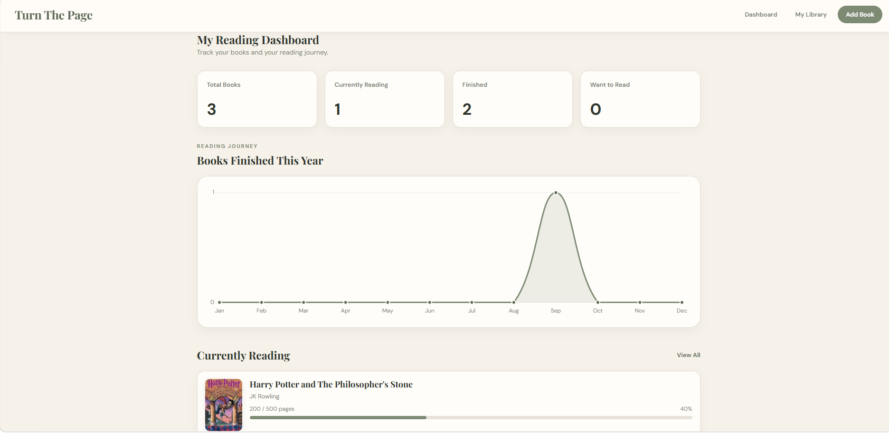
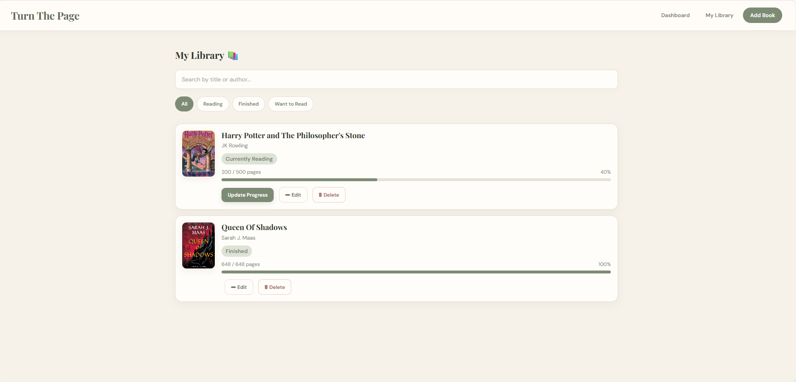

# Turn the Page

A full-stack reading tracker for managing books, tracking reading progress, and visualizing your reading journey.
Built with HTML, CSS, JavaScript, Spring Boot, Spring Data JPA, MySQL, and Chart.js.


## Features

- Add, edit, and delete books from your personal library
- Organize books as Currently Reading, Finished, or Want to Read
- Track reading progress by current and total pages
- Automatically mark books as finished when reading is completed
- View dashboard statistics for your reading activity
- Visualize books finished throughout the year with a monthly Reading Journey chart
- Search books by title or author
- Filter your library by reading status
- Add optional book covers using image URLs
- Responsive interface for desktop, tablet, and mobile
- Persistent book data using a Spring Boot REST API and MySQL


## Tech Stack

### Frontend
- HTML5
- CSS3
- JavaScript
- Chart.js

### Backend
- Java 21
- Spring Boot
- Spring Data JPA
- Hibernate
- Maven

### Database
- MySQL

### Tools
- IntelliJ IDEA
- MySQL Workbench
- Git
- GitHub


## Project Architecture

Turn the Page follows a layered architecture that separates the frontend, business logic, data access, and database responsibilities.

```text
Frontend (HTML / CSS / JavaScript)
              |
              | REST API
              | HTTP Requests
              v
       BookController
              |
              v
         BookService
              |
              v
       BookRepository
              |
              v
 Spring Data JPA / Hibernate
              |
              v
       MySQL Database
```
The frontend communicates with the Spring Boot backend through REST API requests.
- **BookController** handles incoming HTTP requests.
- **BookService** contains the application's business logic.
- **BookRepository** handles data access using Spring Data JPA.
- **Hibernate** maps Java objects to database records and generates the required SQL.
- **MySQL** stores the book data permanently.


## Preview

### Dashboard



### My Library




## Future Improvements

Turn the Page will continue to evolve beyond Version 1. Planned improvements include:

- Automatic book details and cover images using a books API
- User authentication and personal accounts
- Reading history and reread tracking
- More detailed reading analytics and insights
- Personalized book recommendations